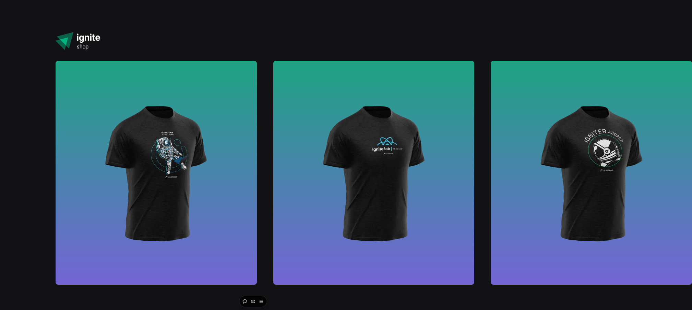

<h1 align="center"> Projeto 5- Primeiro Framework: Next.js </h1>

 Ignite Shop

  <a href="#-tecnologias">Tecnologias</a>&nbsp;&nbsp;&nbsp;|&nbsp;&nbsp;&nbsp;
  <a href="#-projeto">Projeto</a>&nbsp;&nbsp;&nbsp;|&nbsp;&nbsp;&nbsp;
  <a href="#-layout">Layout</a>&nbsp;&nbsp;&nbsp;

 

  </a>

## 🚀 Tecnologias

Esse projeto foi desenvolvido com:

- HTML
- Tailwind CSS
- ReactJS + TypeScript
- Visual Studio Code 
- NextJS
- Git e Github
- ESLint
- API Stripe
- Vercel

## 💻 Projeto

Foi criado um projeto completo com o framework Next.js. Foi ustilizado o Tailwind CSS, passando por conceitos de SPA, server-side rendering (SSR) e static-side generation (SSG). 

---

Feito por Vinícius Brunheroto :wave: (https://viniciusbrunheroto.github.io/linktree-pessoal/)
